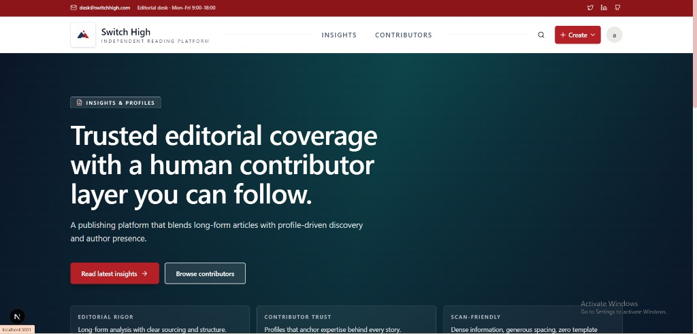
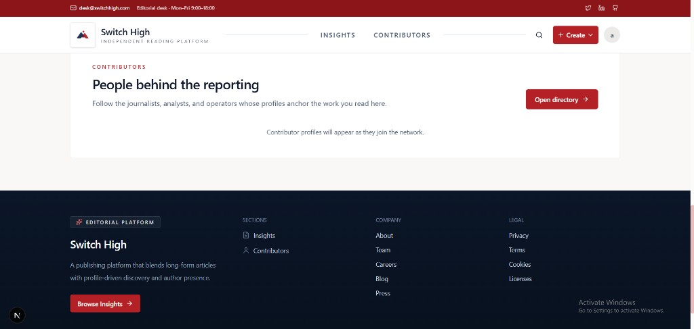
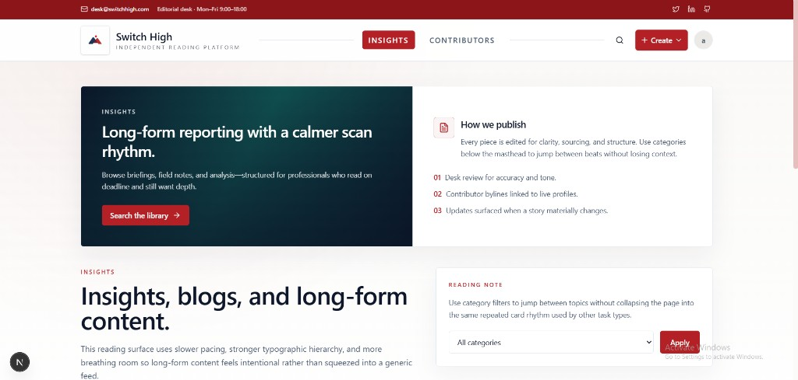
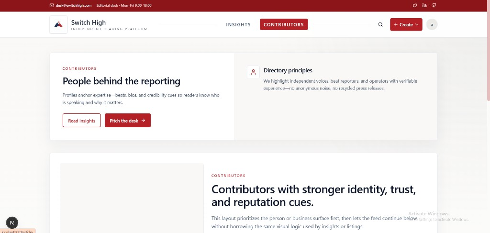
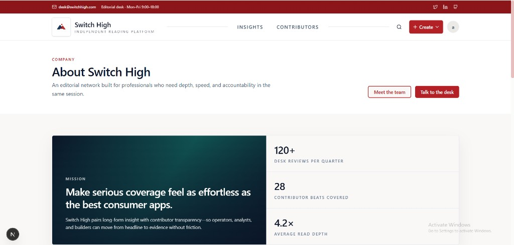

# Switch High

Next.js editorial-style web app: long-form **Insights**, **Contributors**, company pages, and shared navigation/footer. Run locally with `pnpm dev` after `pnpm install`.

## UI screenshots

Images are stored in [`docs/readme/`](docs/readme/) and render inline on GitHub when you view this file on the default branch.

### Home

### Contributors

### Insights (articles)

### Profiles

### About

## Scripts

| Command        | Description        |
| -------------- | ------------------ |
| `pnpm dev`     | Development server |
| `pnpm build`   | Production build   |
| `pnpm start`   | Start production   |
| `pnpm lint`    | ESLint             |

Deployment notes for the VPS stack live under [`deploy/README.md`](deploy/README.md).
